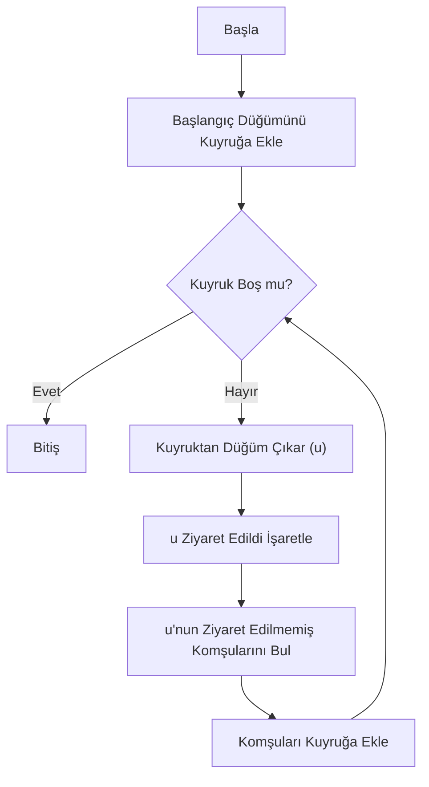
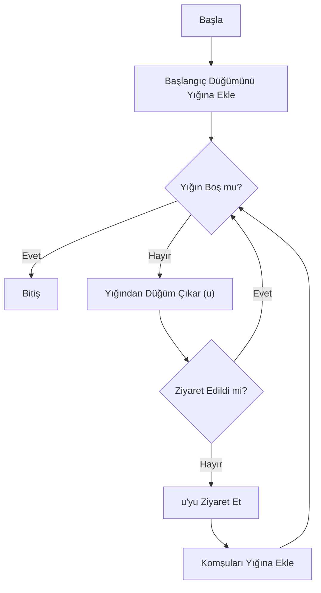
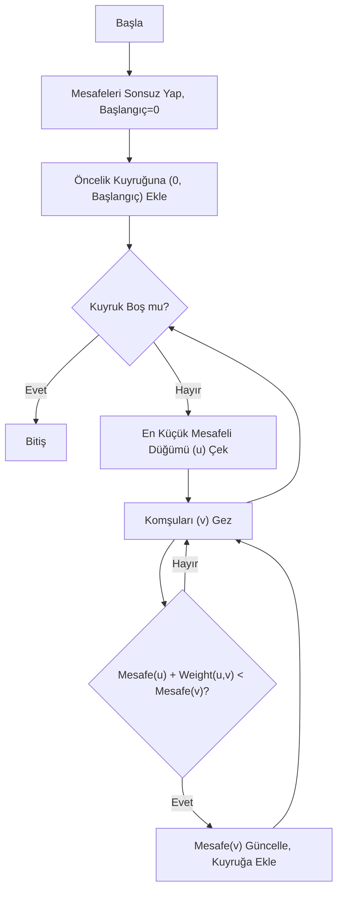
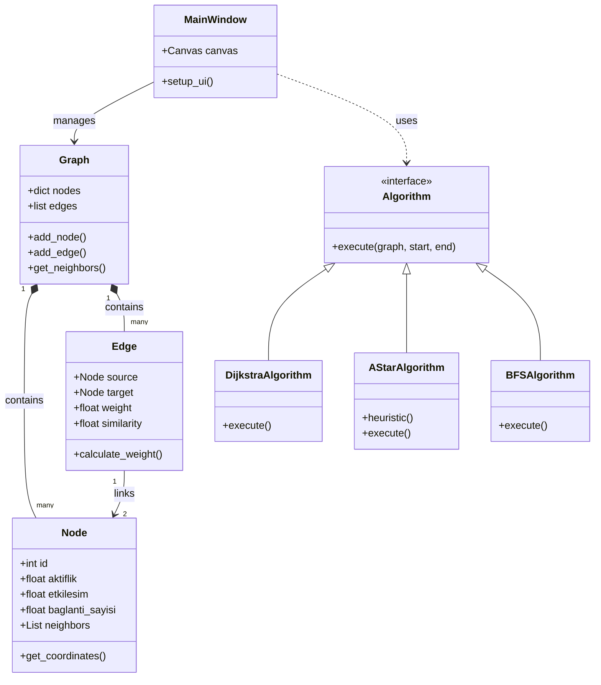
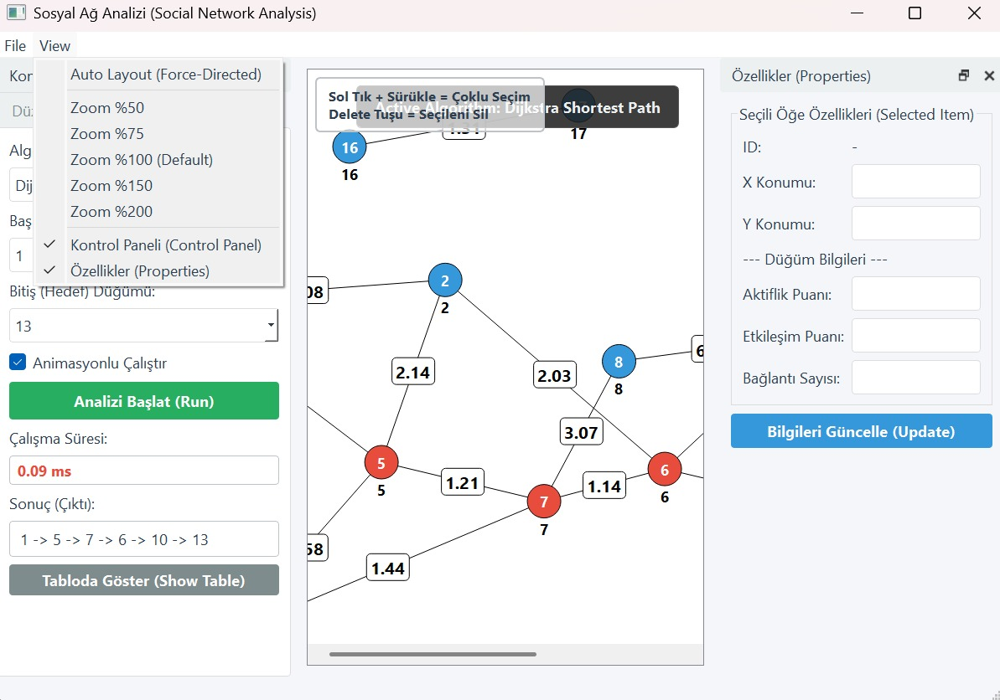
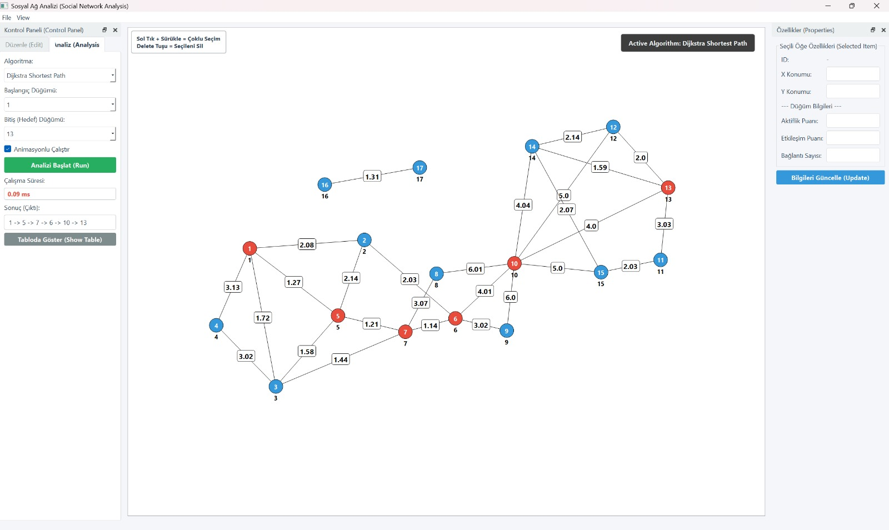

# Sosyal Ağ Analizi Projesi Raporu

## 1. Proje Bilgileri

*   **Proje Adı:** Sosyal Ağ Analizi ve Görselleştirme Uygulaması
*   **Ders:** Yazılım Laboratuvarı II
*   **Tarih:** Ocak 2026
*   **Ekip Üyeleri:**
    *   Efe Süzel - 231307059
    *   Mustafa Mehmet Aslandağ - 231307067

### Kurulum ve Çalıştırma

**Gerekli Kütüphaneler:**
```bash
pip install -r requirements.txt
```

**Uygulamayı Çalıştırma:**
```bash
python main.py
```

---

## 2. Giriş ve Problem Tanımı

### Problemin Tanımı
Sosyal ağlar (social networks), bireylerin veya organizasyonların birbirleriyle olan etkileşimlerini modelleyen karmaşık yapılardır. Bu yapıların büyüklüğü ve karmaşıklığı arttıkça, ağ üzerindeki en etkili kişileri bulmak, iki kişi arasındaki en kısa iletişim yolunu keşfetmek veya ağdaki toplulukları analiz etmek zorlaşmaktadır. Bu analizlerin manuel olarak yapılması imkansızdır; bu nedenle görselleştirme ve algoritmik analiz araçlarına ihtiyaç duyulmaktadır.

### Projenin Amacı
Bu projenin temel amacı, sosyal ağ verilerini interaktif bir şekilde görselleştiren ve üzerinde çeşitli graf teorisi algoritmalarını koşturan masaüstü tabanlı bir yazılım geliştirmektir. Proje kapsamında; kullanıcıların (düğümlerin) özellikleri (aktiflik, etkileşim vb.) dikkate alınarak ağ analizi yapılması ve sonuçların kullanıcıya anlaşılır bir arayüzle sunulması hedeflenmiştir.

---

## 3. Algoritmalar

Projede kullanılan temel algoritmalar aşağıda detaylandırılmıştır.

### 3.1. Breadth-First Search (BFS) - Genişlik Öncelikli Arama

**Çalışma Mantığı:**
BFS, bir başlangıç düğümünden başlayarak grafı katman katman gezen bir algoritmadır. Önce başlangıç düğümünün tüm komşularını, sonra o komşuların komşularını ziyaret eder. Veri yapısı olarak "Kuyruk" (Queue - FIFO) kullanır.

**Karmaşıklık Analizi:**
*   Zaman Karmaşıklığı: **O(V + E)** (V: Düğüm Sayısı, E: Kenar Sayısı)
*   Alan Karmaşıklığı: **O(V)**

**Akış Diyagramı:**


### 3.2. Depth-First Search (DFS) - Derinlik Öncelikli Arama

**Çalışma Mantığı:**
DFS, bir yoldan gidebildiği kadar derine inen ve son noktaya ulaştığında geri dönen (backtracking) bir algoritmadır. Veri yapısı olarak "Yığın" (Stack - LIFO) veya özyineleme (recursion) kullanır.

**Karmaşıklık Analizi:**
*   Zaman Karmaşıklığı: **O(V + E)**
*   Alan Karmaşıklığı: **O(V)**

**Akış Diyagramı:**


### 3.3. Dijkstra En Kısa Yol Algoritması

**Çalışma Mantığı:**
Ağırlıklı graflarda başlangıç düğümünden diğer tüm düğümlere olan en kısa yolu bulur. "Açgözlü" (Greedy) bir yaklaşım sergiler ve her adımda ulaşılması en az maliyetli düğümü seçer. Projede ağırlık (weight), düğümler arasındaki sosyal benzerlik özelliklerine göre `1 + Feature_Distance` formülüyle hesaplanmıştır.

**Karmaşıklık Analizi:**
*   Zaman Karmaşıklığı (Priority Queue ile): **O(E + V log V)**

**Akış Diyagramı:**


### 3.4. A* (A-Star) Algoritması

**Çalışma Mantığı:**
Dijkstra'nın geliştirilmiş halidir. Hedefe ne kadar yaklaşıldığını tahmin eden bir `h(n)` (heuristic) fonksiyonu kullanır. Projede heuristic olarak "Özellik Uzayındaki Öklid Mesafesi" kullanılmıştır.
*   `f(n) = g(n) + h(n)` (Toplam Tahmini Maliyet = Gerçek Maliyet + Sezgisel Maliyet)

**Karmaşıklık Analizi:**
*   Zaman Karmaşıklığı: Heuristic fonksiyonuna bağlı olarak değişir, en kötü durumda **O(E)**.

---

## 4. Yazılım Mimarisi ve Sınıf Yapısı

Proje, **Model-View-Controller (MVC)** benzeri bir yaklaşımla modüllere ayrılmıştır.

### 4.1. Modül Yapısı
1.  **src.model:** Veri yapılarını (`Node`, `Edge`, `Graph`) barındırır.
2.  **src.algorithms:** Mantıksal hesaplamaları (`BFS`, `Dijkstra` vb.) içerir.
3.  **src.ui:** Kullanıcı arayüzü (`MainWindow`, `Canvas`) işlemlerini yönetir.

### 4.2. Sınıf Diyagramı (Mermaid)



---

## 5. Uygulama Açıklamaları ve Test Senaryoları

### 5.1. Arayüz ve Özellikler
Uygulama açıldığında boş bir canvas gelir. Kullanıcı sol panelden düğüm ekleyebilir, sağ tık menüsü ile düğümleri silebilir veya özelliklerini değiştirebilir. "Analiz Algoritmaları" menüsünden istenilen algoritma seçilip çalıştırıldığında sonuçlar görsel olarak (renklendirilmiş yollar) sunulur.

### 5.2. Test Senaryoları

| Senaryo ID | Açıklama | Beklenen Sonuç | Sonuç |
| :--- | :--- | :--- | :--- |
| **TS-01** | Graf Yükleme | `data` klasöründeki CSV/XML dosyasının hatasız yüklenmesi. | Başarılı |
| **TS-02** | Düğüm Silme | Seçilen düğümün ve bağlı tüm kenarların silinmesi. | Başarılı |
| **TS-03** | Dijkstra Testi | Ağırlığı yüksek kenarlar yerine daha düşük maliyetli uzun yolun seçilmesi. | Başarılı |
| **TS-04** | A* Hız Testi | Dijkstra'ya göre daha az düğüm ziyaret ederek hedefe ulaşması. | Başarılı |
| **TS-05** | Ayrık Graf | Bağlantısı olmayan iki düğüm arasında yol arandığında "Yol Bulunamadı" uyarısı. | Başarılı |

**Uygulama Ekran Görüntüleri:**






---

## 6. Sonuç ve Tartışma

### 6.1. Başarılar
*   Karmaşık sosyal ağ verilerinin Python ve PyQt5 ile performanslı bir şekilde görselleştirilmesi sağlandı.
*   Nesne tabanlı mimari sayesinde yeni algoritmaların (örneğin Betweenness Centrality) sisteme eklenmesi çok kolay hale getirildi.
*   Kullanıcı deneyimi (UX), sürükle-bırak özellikleri ve anlık geri bildirimlerle zenginleştirildi.

### 6.2. Sınırlılıklar
*   **Büyük Veri:** 10.000+ düğüm içeren çok büyük ağlarda, görselleştirme kütüphanesinden kaynaklı performans düşüşleri (FPS kaybı) yaşanabilmektedir.
*   **3D Görselleştirme:** Şu an sadece 2D düzlemde görselleştirme yapılmaktadır.

### 6.3. Gelecek Geliştirmeler
*   Uygulamanın Web tabanlı (React/D3.js) bir versiyonunun geliştirilmesi.
*   Büyük veri setleri için GPU hızlandırmalı çizim kütüphanelerinin (OpenGL) entegrasyonu.
*   Veri tabanı entegrasyonu ile (PostgreSQL/Neo4j) verilerin kalıcı ve ilişkisel olarak saklanması.
